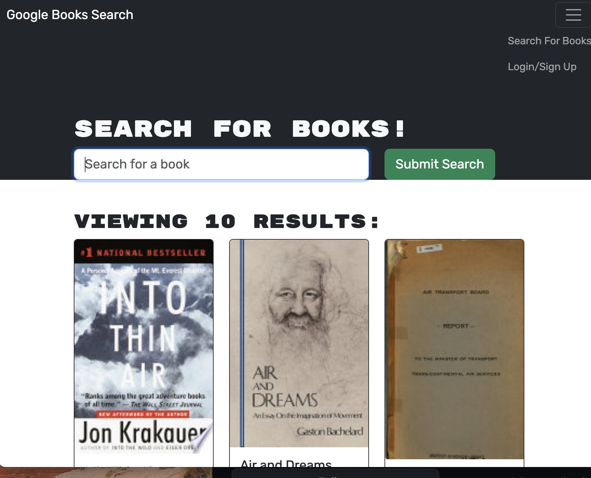

# Book Search Engine 

Week-21 Challenge (MERN)

## Table of Contents

- [Description](#description)

- [Live-URL](#live-url)

- [Screenshot](#screenshot)

- [Technologies-Used](#technologies-used)

- [Installation](#installation)

- [Credits](#credits)

- [Features](#features)

- [Usage-Information](#usage-information)

- [Suggested-Future-Development](#suggested-future-development)

- [Contribution-Guidelines](#contribution-guidelines)

- [Test-Instructions](#test-instructions)

- [License](#license)

- [Questions](#questions)

## Description

This application was refactored from using strictly routing and express, to now implementing GraphQL typeDefs, resolvers and an Apollo Server. The backend uses MongoDB; it mixes Mongoose and GraphQL queries and mutations to run queries and mutations from the UI to the database.

## Live URL

[Link to live URL](https://book-engine-tg-fecb6ddc4a1b.herokuapp.com/)

## Screenshots

## Technologies Used

This application is powered by JavaScript,React.js , Node.js , Express.js, GraphQL, and ApolloServer. 
CSS and Bootstrap  were utilized to create the overall styling of the user interface.

## Credits

AskBCS  helped me trouble shoot Heroku deployment issues, as i didn't firstly connected to mongodb.

## Questions
Click the links below to reach me through my GitHub account or Email address.

[Link to Github](https://github.com/gtotaku-tg)

<a href="gtotaku@live.com">gtotaku@live.com</a>

